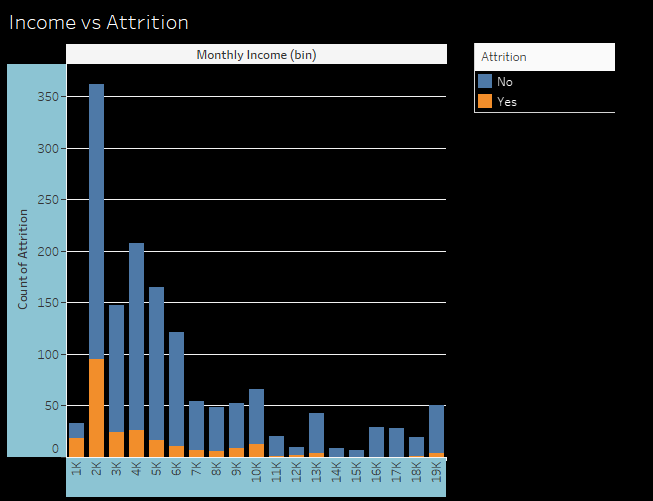
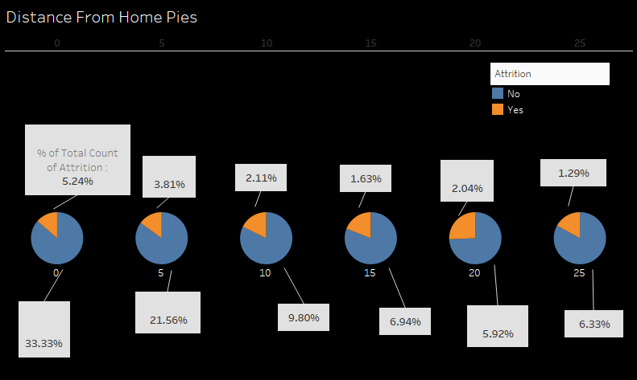

# The Tale of Flight Risk & the Holy Grail of Corporate Happiness
## *Predicting Employee Attrition and Exploring it's Causes*
---
 

## Why is understanding WHEN and WHY employees quit important?

Intimately understanding employee attrition and its causes empowers organizations from any sector to retain the most skilled workers, save on costly training, and improve overall organizational culture and employee sentiment. It is also symbiotic, which is one of the biggest testaments of whether a system is successful and will last.  Focusing on employee retention benefits not just the organization’s success and longevity, but also the employees, so the system continues to feed itself.  And employee attrition affects EVERY industry.

According to the Work Institute, most of the cost from employee churn actually comes from hidden or “soft” costs, such as loss of productivity, knowledge and time.  Trading out one employee for another is not an even trade.  As you can see in the graph below, there is a significant amount of time where money is being lost before a new hire starts to produce a return for the company, and an even longer time before they can get to the level of engagement and productivity of the employee whose shoes they are filling.
 
 

When an organization loses an employee, this really equates to approximately 1.5 – 2x the previous employee’s annual salary in hard costs.  Money that could have gone into keeping the employee happy and retaining them. For hourly workers, approximately $1,500, and estimates range based on type of position and seniority.

One must consider all the hard and soft costs of failing to retain valuable employees.  During the hiring process, there are costs involved with advertising job openings, interviewing and screening, time and training during onboarding, and loss of productivity, as a new person may take 1-2 years to reach the productivity of the previous employee.  Loss of business, as the new employees are less adept at problem solving and responding to issues, and may actually not even end up being a good fit for the company. Cultural impact.  Whenever someone leaves, others inherently ask why, and no one wants to go down with a sinking ship.  And the stress of understaffing can result in burnout. 
 
 

If employers were able to make a best guess at predicting when their current employees might quit and why, they may be able to intervene in time.
 
 

## Project Overview

For our project, we created and tested a few different machine learning models to predict whether an employee is likely to quit based on various features, then deployed the model to be used by employers on our website.  We continued to explore the data based on the most highly weighted features, as determined by our random forest model’s feature importance classification.  Data exploration began with SQL querries, but visualizations developed in Tableau and from Python's Seaborn provided the most insight into our data's attrition trends, which can be used to assist organizations with developing possible solutions. 

Our analysis and predictions can assist employers with getting to the root of employee grievances and what makes them stay, guide management on timing for engagement with their employees, raises or role restructuring, and improve the workplace environment for the employees. 
 
 

## Data Cleaning and Preparing For Machine Learning
The data came to us quite clean and not very many actions were needed to clean it. Columns with ambiguously explained data, unique identifiers, and with values that were the same throughout each rows were dropped. 

To prepare the data for machine learning, the categorical data was first encoded. There was evidence of multicollinearity, which is when 2 or more of the features are highly correlated to each other. To address this issue, four more columns were dropped. The non-encoded columns were then standardized.

 
 

## Machine Learning

Three machine learning models were created, tested and optimized to determine the best fit for our website deployment: Logistic Regression, Random Forest and Neural Network models.
 
 

### Logistic Regression Model

The purpose of the model was to predict whether an employee will stay or leave their current job.  The model predicted at 75.47% accuracy. The classification report is below. 

### Random Forest

we used this model both because it is good for binary classification as well as the fact that it could determine feature importance which we weould use in the exploratory analysis. it ended up with an 84% accuracy but due to the high number of false negatives we did not end up using this model.
The classification report, confusion matrix and feture importance can be seen below.

### Neural Network
The Neural network we ended with used 2 layers as well as an ouput layer. The Keras sequential model was used along with 3 layers using the sigmoid activation functoin, as it is the best for binary classification. it ended with a 87.41% accuracy with a loss of 1.97 so it performed extremely well. However given it was completed late in the process and we were unabl to get the breakdown of false positives and negatives we did not use this on the website.
 
 

## Dashboard

We completed feature elimination by determining feature importance from the random forest model and also ascertaining the features that are influenced by multiculinearity. We reduced the features to 23 in total for the app which also increases the likelihood of a user to fill out the form in its entirety. We decided to utilize the logistic regression model among all models because it contained the least amount of false negative values during training and testing. The model is then saved and loaded into the app through serialization and de-serialization. 

A key is provided to the user so that every input is numerical. Placeholders within each textbox are values of the first row of the dataset. Eash field is required so that any missing input will be pointed out to the user and data will not be posted to the server until every textbox is filled. The model utilizes user input to calculate the probability of an employee staying compared to leaving and returns the more probable result.

Example result

 
 

## Exploratory Data Analysis
One of the first things we noticed about our data was that it was compromised of mostly two different categories: work-related features, meaning factors that the organization could manage or adjust, and personal features that the organization has no control over, such as age or marital status.  Based on the random forest’s feature importance classifications, we decided to dig deeper into the top 6 highly weighted features, and a few of their correlated features.

Our random forest model's feature importance classification determined income, age, whether an employee was working overtime, their years at the company, the employee's total working years, and their distance from home to work to be the most heavily weighted or important features in predicting attrition.

We considered which features were in control of the organization and debated whether to include exploration of age and total working years, but due to the way those features interplayed with other features, and findings from external data that note how an employee's needs may change based on age, we decided to further explore all of the top six important features and a few additional visualizations to show a more complete story of the data. Using Python's Seaborn library and Tableau, trends about the data were uncovered:
 
 

## Income vs. Attrition

 
 

## Percent Salary Hike vs. Attrition

### Age Vs. Attrition

### Total Working Years vs. Attrition

 
 

### Number of Companies Worked For vs. Attrition

### Years at Company vs. Attrition

### Overtime vs. Attrition

 
 

### Distance From Home vs. Attrition

 
 

## Findings
Not shockingly, the data is telling us that those who are paid more generally make more money.  C.R.E.A.M.  But we did notice a few more interesting patterns about the income data when compared to outside data.  (Discuss importance of employee engagement, include outside visualizations)

We found that younger employees and employees and closer to the start of their career were more likley to leave their job, likely to leave to pursue other opportunities in the beginning their careers. (Discuss findings of visualizations more in depth).

(Discuss overtime and Distance from Home.)

While attrition is a problem that effects every industry, use of our predictive models and findings are most helpful for large-scale organizations, where individual sentiment often flies under the radar and employees fall through the cracks. 

### Resources
- Data source: IBM_employee_data.csv (located in "resources" folder)
- Software: 
    - Jupyter Notebook
    - pgAdmin (add versions later)
    - AWS/RDS
    - VS Code
    - Tableau
    
### Citations

### Link to Presentation Slides
https://docs.google.com/presentation/d/1GCnuq3QFD7YBTuNLOd9c_YpS5zzCBbDL3zUX_teldi0/edit?usp=sharing
