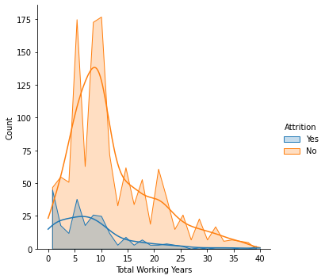

# Employee Attrition Prediction and Analysis
## *Predicting Attrition and Exploring Reasons Behind Why People are Shifting Jobs*
## Link to Dashboard:

 

### Overview: 
---
#### Purpose
 
Intimately understanding employee attrition and its causes empowers organizations from any sector to retain the most skilled workers, save on costly training, and improve overall organizational culture and employee sentiment.  While attrition is a problem that effects every industry, use of our predictive models and findings are most helpful for large-scale organizations, where individual sentiment often flies under the radar and employees fall through the cracks.  
 
 

#### Process
Our analysis and predictions can assist employers with getting to the root of employee grievances, guide management on timing for engagement with their employees, raises or role restructuring, and improve the workplace environment for the employees. (To develop further purpose based on additional dataset, widening scope to either how attrition affects the customer base or more about the employees?)
 
 

#### Findings
Briefly, we found that younger people and closer to the start of their career were more likley to leave their job.
 
 

#### Components of Project
- 3 Machine Learning Models
    - Logistic Regression
    - Random Forest
    - Neural Network

- Dashboard
    - Users can determine whether or not they are likely to stay in their current job by finding in a select number of boxes.
 
 

### Process
#### Data Source
- IBM_employee_data.csv 

#### Data Cleaning and Preparing for Machine Learning
The data came to us quite clean and not very many actions were needed to clean it. Columns with ambiguously explained data, unique identifiers, and with values that were the same throughout each rows were dropped. 

To prepare the data for machine learning, the categorical data was first encoded. There was evidence of multicollinearity, which is when 2 or more of the features are highly correlated to each other. To address this issue, four more columns were dropped. The non-encoded columns were then standardized.

#### Logistic Regression Model

The purpose of the model was to predict whether an employee will stay or leave their current job.  The model predicted at 75.47% accuracy. The classification report is below. 

#### Random Forest
Stephen
#### Neural Network
Stephen
 
 

### Exploratory Data Analysis
#### Findings
Using Python's seaborn library and Tableau, trends about the data were uncovered. The data is telling us that those who are more likely to leave to pursue other opportunities are younger and in the beginning their careers.

##### Age Vs. Attrition

##### Total Working Years Vs. Attrition

##### Number of Companies Worked For Vs. Attrition

##### Years at Company Vs. Attrition

 
 

### Software/Tools Used:
 - pgAdmin (add versions later)
- Google Collab
- Python
    - Pandas
    - Sklearn
- PostgreSQL
- AWS
- Jupyter Notebook
- VS Code
- Tableau   

##### Link to Presentation Slides

 